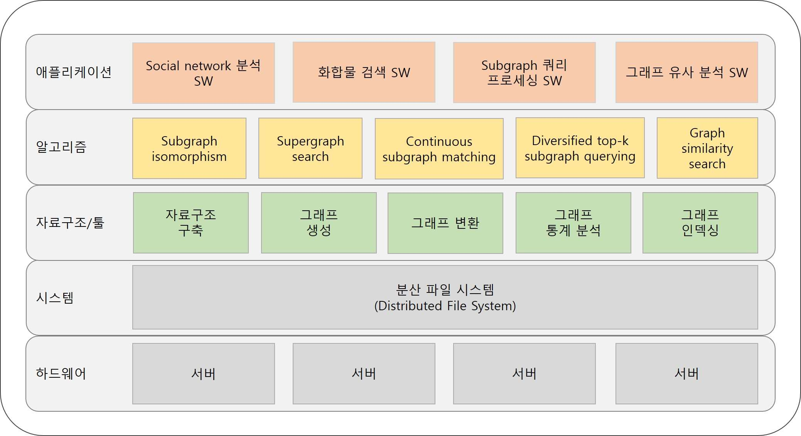

# NP-hard 통합 프레임워크

  

- 애플리케이션
  - Social network 분석 SW - [SocialNetworkAnalysis](https://github.com/SNUCSE-CTA/SocialNetworkAnalysis)
  - 화합물 검색 SW - [CompoundSearch](https://github.com/SNUCSE-CTA/CompoundSearch)
  - Subgraph 쿼리 프로세싱 SW - [SubQP](https://github.com/SNUCSE-CTA/SubQP)
  - 그래프 유사 분석 SW - [ChemSearch](https://github.com/SNUCSE-CTA/ChemSearch)
- 알고리즘
  - Subgraph isomorphism - [DAF](https://github.com/SNUCSE-CTA/DAF), [VEQ_S](https://github.com/SNUCSE-CTA/VEQ_S), [BICE](https://github.com/SNUCSE-CTA/BICE)
  - Supergraph search - [IDAR](https://github.com/SNUCSE-CTA/IDAR)
  - Continuous subgraph matching - [SymBi](https://github.com/SNUCSE-CTA/SymBi)
  - Diversified top-k subgraph querying - [DiversifiedSubgraphQuerying](https://github.com/SNUCSE-CTA/DiversifiedSubgraphQuerying)
  - Graph similarity search - [GSSBBB](https://github.com/SNUCSE-CTA/GSSBBB)
- 자료구조/툴
  - 그래프 생성 - [graph-generation-tool](https://github.com/SNUCSE-CTA/graph-generation-tool)
  - 그래프 통계 분석 - [graph-analysis-tool](https://github.com/SNUCSE-CTA/graph-analysis-tool)
